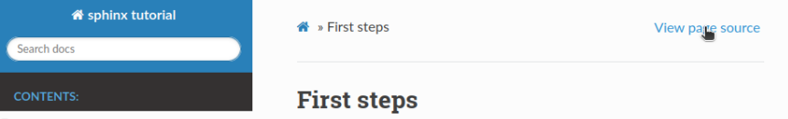

First steps
===========

Install Sphinx
--------------
You'll need to have Python and PIP installed.

.. code-block:: bash

    pip install sphinx sphinx_rtd_theme

Prepare sphinx documentation
----------------------------
Ideally, you'll store your documentation in ``/docs``

.. code-block:: bash

    # login into the cluster (antlogin)
    cd ~/public
    
    # create project/docs and enter it
    mkdir -p project/docs
    cd project/docs
    
    # setup sphinx for given project
    sphinx-quickstart

Now you can edit ``index.rst`` and create new documents.
Note, all documents need to be refered in ``toctree`` in ``index.rst``.

You can learn more about ``.rst`` (reStructuredText) formatting 
`here <https://www.sphinx-doc.org/en/master/usage/restructuredtext/basics.html>`_.

And remember, you can always see the source by clicking ``View page source`` :)

Build html
----------
To build ``html``, just execute:

.. code-block:: bash

    make html

Note, you'll need to rebuild documentation after every change you make ;)

You can see your documentation at (of course change ``lpryszcz`` to your own username)
https://public-docs.crg.es/enovoa/public/lpryszcz/project/docs/_build/html

To make it simpler, just link ``docs/_build/html`` as ``html``:

.. code-block:: bash

    ln -s docs/_build/html ../html

Then you'll be able to access your documentation at 
https://public-docs.crg.es/enovoa/public/lpryszcz/project/html

Change the theme
----------------
Open ``conf.py``
and change line starting with ``html_theme``
to ``html_theme = 'sphinx_rtd_theme'``.
Save changes. 
Don't forget to execute ``make html``.

Publish it
----------
Once your project is public on GitHub, you can link your documentation in
`ReadTheDocs <https://readthedocs.org/>`_.
