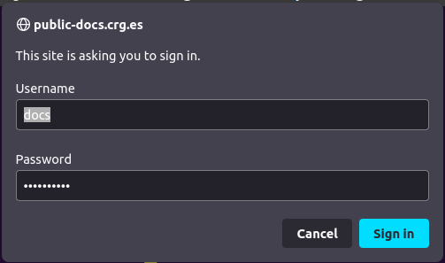

Protect your public folder
=========================

Unlist certain folders
----------------------
Create ``.htaccess`` file containg

.. code-block:: bash

    Options -Indexes

If you place it in ``~/public``,
all folders under ``~/public`` won't be accessible.
For example https://public-docs.crg.es/enovoa/public/lpryszcz

If you wish to enable listing of certain folders,
just create ``.htaccess`` file inside that folder containg

.. code-block:: bash

    Options +Indexes

For example https://public-docs.crg.es/enovoa/public/lpryszcz/src/nanoRMS2/test

**Note, unlisting files isn't very secure.**
People still can access files if the know their path.
For example, https://public-docs.crg.es/enovoa/public/lpryszcz/unlisted.txt
    
Password-protected access
-------------------------

Generate password for user ``docs``

.. code-block:: bash

    htpasswd ~/.htpasswd docs

Make sure you store ``.htpasswd`` file outside of your ``~/public`` folder!

And to protect ``_build/html`` with above username/password,
you'll need to create ``_build/html/.htaccess`` file

.. code-block:: bash

   #Protect Directory
   AuthType Basic
   AuthName "Restricted Access"
   AuthUserFile /users/enovoa/lpryszcz/.htpasswd
   #Require valid-user
   Require user docs

Naturally, you'll need to point ``AuthUserFile`` to your ``.htpasswd`` file location. 
If you wish to allow all users from ``~/.htpasswd``,
just leave ``Require valid-user`` uncommented
and comment out the last line.

And from now on, when someone tries to access your documentation,
they will be prompted for a password.
Note, webbrowsers remember the passwords, so likely it'll ask you only once.

