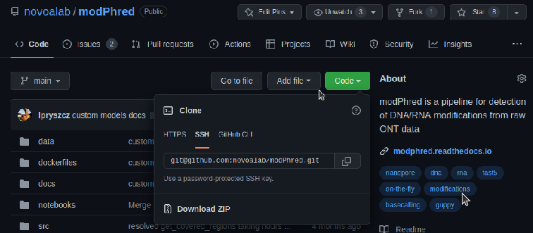

SSH tips & tricks
=================

SSH without password
--------------------

First, generate private and public key

.. code-block:: bash

    ssh-keygen

Then export this key to remote machine

.. code-block:: bash

    ssh-copy-id ant-login6.linux.crg.es

Note, the cluster has very old SSH, so with new versions of SSH,
you'll need to generate ``ed25519`` key

.. code-block:: bash

    ssh-keygen -t ed25519 -C 'name@email.com'

If you don't have a keyring (ie in remote session), you will need to run

.. code-block:: bash

    ssh-agent bash
    ssh-add

GitHub without password
-----------------------

Now, you can operate github passwordless. The only thing to do is to
`add your pubkey to github <https://github.com/settings/ssh/new>`_.

You can see you pubkey using
.. code-block:: bash

    cat ~/.ssh/id_rsa.pub

Make sure you use SSH instead of HTTPS when cloning github repos!

	   
